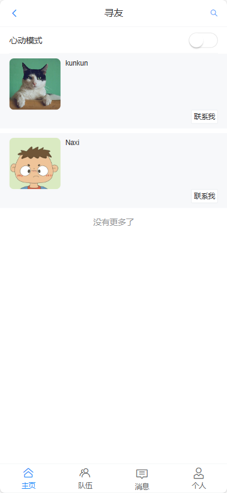
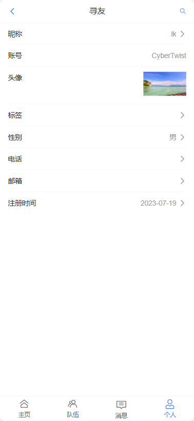
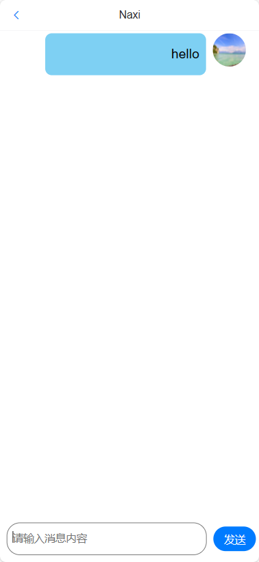

# 寻友-前端

## 项目简介
一个提供组队、聊天功能、帮助大家找到志同道合的伙伴的移动端网站（APP 风格）。包括用户登录注册、私聊、更新个人信息、按标签搜索用户、推荐相似用户、组队等功能。

## 在线访问网站
https://friends.codelearn.top

#### 主页：

#### 个人信息：

#### 私聊

#### 消息

#### 队伍

## 技术栈
#### 前端
- Vue 3
- Vant UI 组件库
- TypeScript
- Vite 脚手架
- Axios 请求库
#### 后端
- Java SpringBoot 2.7.x 框架
- MyBatis-Plus
- Redis 缓存
- Redisson 分布式锁
- Spring Scheduler 定时任务
- Swagger + Knife4j 接口文档
- Gson：JSON 序列化库
- 相似度匹配算法
- WebSocket 通信

## 运行项目
- npm install
- npm run dev